# vitepress

## 初始化

1. .npmrc:`registry=https://registry.npmmirror.com`
1. `npm add -D vitepress`
1. `npx vitepress init`
1. `npm run dev`

## Markdown 语法

<https://markdown.com.cn/editor/>

### 2.1 标题

不同数量的`#`可以完成不同的标题，如下：

# 一级标题

## 二级标题

### 三级标题

### 2.2 字体

粗体、斜体、粗体和斜体，删除线，需要在文字前后加不同的标记符号。如下：

**这个是粗体**

_这个是斜体_

**_这个是粗体加斜体_**

~这里想用删除线~~

注：如果想给字体换颜色、字体或者居中显示，需要使用内嵌 HTML 来实现。

### 2.3 无序列表

无序列表的使用，在符号`-`后加空格使用。如下：

- 无序列表 1
- 无序列表 2
- 无序列表 3

如果要控制列表的层级，则需要在符号`-`前使用空格。如下：

- 无序列表 1
- 无序列表 2
  - 无序列表 2.1
  - 无序列表 2.2

**由于微信原因，最多支持到二级列表**。

### 2.4 有序列表

有序列表的使用，在数字及符号`.`后加空格后输入内容，如下：

1. 有序列表 1
2. 有序列表 2
3. 有序列表 3

### 2.5 引用

引用的格式是在符号`>`后面书写文字。如下：

> 读一本好书，就是在和高尚的人谈话。 ——歌德

> 雇用制度对工人不利，但工人根本无力摆脱这个制度。 ——阮一峰

### 2.7 链接

微信公众号仅支持公众号文章链接，即域名为`https://mp.weixin.qq.com/`的合法链接。使用方法如下所示：

对于该论述，欢迎读者查阅之前发过的文章，[你是《未来世界的幸存者》么？](https://mp.weixin.qq.com/s/s5IhxV2ooX3JN_X416nidA)
<a id="jump_8"></a>

### 2.8 图片

插入图片，格式如下：


支持 jpg、png、gif、svg 等图片格式，**其中 svg 文件仅可在微信公众平台中使用**，svg 文件示例如下：


支持图片**拖拽和截图粘贴**到编辑器中。

注：支持图片 **_拖拽和截图粘贴_** 到编辑器中，仅支持 https 的图片，图片粘贴到微信时会自动上传微信服务器。

### 2.9 分割线

可以在一行中用三个以上的减号来建立一个分隔线，同时需要在分隔线的上面空一行。如下：

---

### 2.10 表格

可以使用冒号来定义表格的对齐方式，如下：

| 姓名       | 年龄 |         工作 |
| :--------- | :--: | -----------: |
| 小可爱     |  18  |     吃可爱多 |
| 小小勇敢   |  20  |   爬棵勇敢树 |
| 小小小机智 |  22  | 看一本机智书 |

## 3. 特殊语法

### 3.1 脚注

> 支持平台：微信公众号、知乎。

脚注与链接的区别如下所示：

```markdown
链接：[文字](链接)
脚注：[文字](脚注解释 "脚注名字")
```

有人认为在[大前端时代](https://en.wikipedia.org/wiki/Front-end_web_development "Front-end web development")的背景下，移动端开发（Android、IOS）将逐步退出历史舞台。

[全栈工程师](是指掌握多种技能，并能利用多种技能独立完成产品的人。 "什么是全栈工程师")在业务开发流程中起到了至关重要的作用。

脚注内容请拉到最下面观看。

### 3.2 代码块

> 支持平台：微信代码主题仅支持微信公众号！其他主题无限制。

如果在一个行内需要引用代码，只要用反引号引起来就好，如下：

Use the `printf()` function.

在需要高亮的代码块的前一行及后一行使用三个反引号，同时**第一行反引号后面表示代码块所使用的语言**，如下：

```java
// FileName: HelloWorld.java
public class HelloWorld {
  // Java 入口程序，程序从此入口
  public static void main(String[] args) {
    System.out.println("Hello,World!"); // 向控制台打印一条语句
  }
}
```

支持以下语言种类：

```
bash
clojure，cpp，cs，css
dart，dockerfile, diff
erlang
go，gradle，groovy
haskell
java，javascript，json，julia
kotlin
lisp，lua
makefile，markdown，matlab
objectivec
perl，php，python
r，ruby，rust
scala，shell，sql，swift
tex，typescript
verilog，vhdl
xml
yaml
```

如果想要更换代码高亮样式，可在上方**代码主题**中挑选。

其中**微信代码主题与微信官方一致**，有以下注意事项：

- 带行号且不换行，代码大小与官方一致
- 需要在代码块处标志语言，否则无法高亮
- 粘贴到公众号后，用鼠标点代码块内外一次，完成高亮

diff 不能同时和其他语言的高亮同时显示，且需要调整代码主题为微信代码主题以外的代码主题才能看到 diff 效果，使用效果如下:

```diff
+ 新增项
- 删除项
```

**其他主题不带行号，可自定义是否换行，代码大小与当前编辑器一致**

### 3.3 数学公式

> 支持平台：微信公众号、知乎。

行内公式使用方法，比如这个化学公式：$\ce{Hg^2+ ->[I-] HgI2 ->[I-] [Hg^{II}I4]^2-}$

块公式使用方法如下：

$$H(D_2) = -\left(\frac{2}{4}\log_2 \frac{2}{4} + \frac{2}{4}\log_2 \frac{2}{4}\right) = 1$$

矩阵：

$$
  \begin{pmatrix}
  1 & a_1 & a_1^2 & \cdots & a_1^n \\
  1 & a_2 & a_2^2 & \cdots & a_2^n \\
  \vdots & \vdots & \vdots & \ddots & \vdots \\
  1 & a_m & a_m^2 & \cdots & a_m^n \\
  \end{pmatrix}
$$

公式由于微信不支持，目前的解决方案是转成 svg 放到微信中，无需调整，矢量不失真。

目前测试如果公式量过大，在 Chrome 下会存在粘贴后无响应，但是在 Firefox 中始终能够成功。

### 3.4 TOC

> 支持平台：微信公众号、知乎。

TOC 全称为 Table of Content，列出全部标题。

[TOC]

由于微信只支持到二级列表，本工具仅支持二级标题和三级标题的显示。

### 3.5 注音符号

> 支持平台：微信公众号。

支持注音符号，用法如下：

Markdown Nice 这么好用，简直是{喜大普奔|hē hē hē hē}呀！

### 3.6 横屏滑动幻灯片

> 支持平台：微信公众号。

通过`<,>`这种语法设置横屏滑动滑动片，具体用法如下：

<,,>

## 4 其他语法

### 4.1 HTML

支持原生 HTML 语法，请写内联样式，如下：

<span style="display:block;text-align:right;color:orangered;">橙色居右</span>
<span style="display:block;text-align:center;color:orangered;">橙色居中</span>

### 4.2 UML

不支持，推荐使用开源工具`https://draw.io/`制作后再导入图片

## Mermaid

<https://mermaid.nodejs.cn/syntax/examples.html>

### 流程图


```mermaid
graph TD;
    A-->B;
    A-->C;
    B-->D;
    C-->D;
```

### 时序图

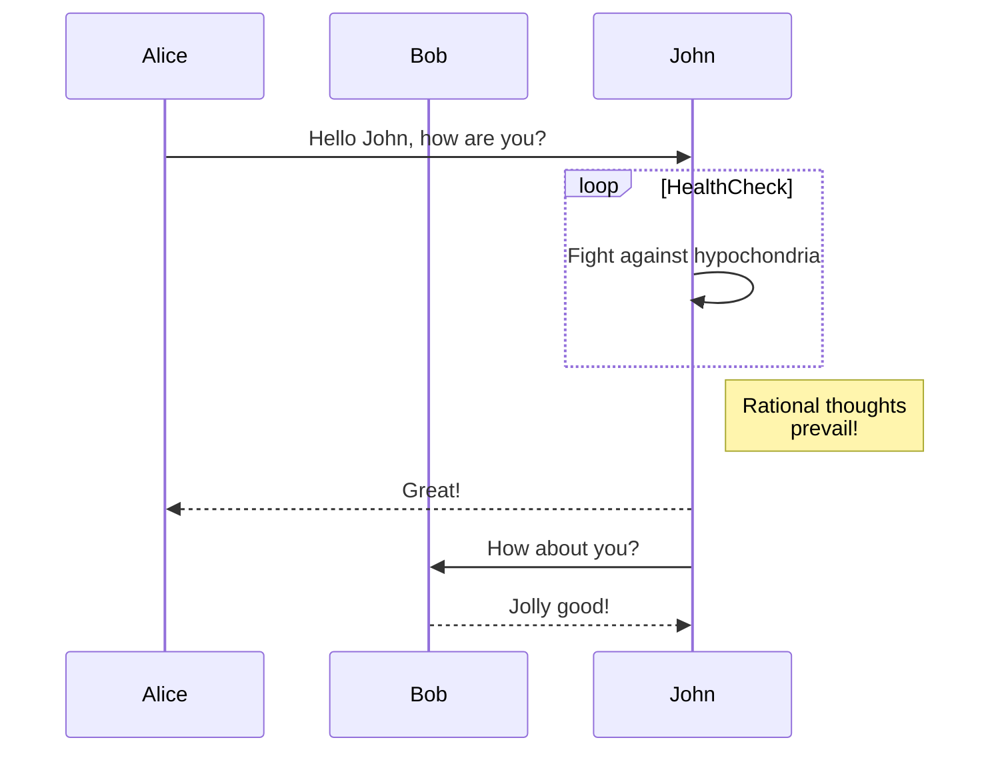
```mermaid
sequenceDiagram
    participant Alice
    participant Bob
    Alice->>John: Hello John, how are you?
    loop HealthCheck
        John->>John: Fight against hypochondria
    end
    Note right of John: Rational thoughts <br/>prevail!
    John-->>Alice: Great!
    John->>Bob: How about you?
    Bob-->>John: Jolly good!
```

### 类图

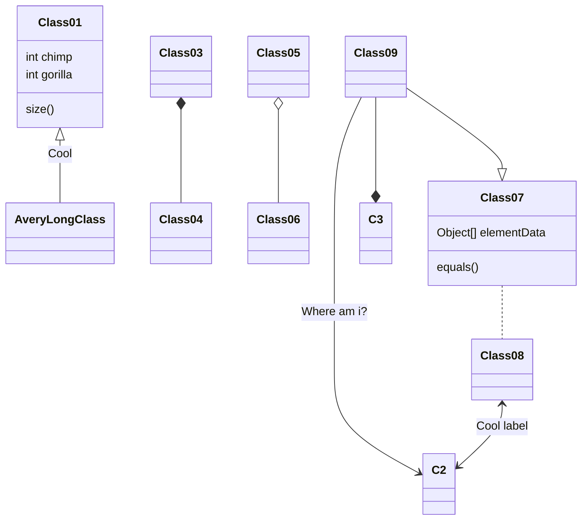
```mermaid
classDiagram
Class01 <|-- AveryLongClass : Cool
Class03 *-- Class04
Class05 o-- Class06
Class07 .. Class08
Class09 --> C2 : Where am i?
Class09 --* C3
Class09 --|> Class07
Class07 : equals()
Class07 : Object[] elementData
Class01 : size()
Class01 : int chimp
Class01 : int gorilla
Class08 <--> C2: Cool label
```

### 状态图

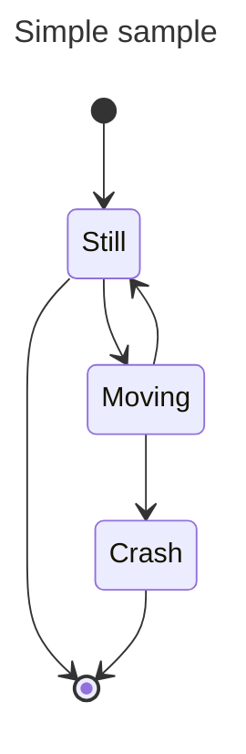
```mermaid
---
title: Simple sample
---
stateDiagram-v2
    [*] --> Still
    Still --> [*]

    Still --> Moving
    Moving --> Still
    Moving --> Crash
    Crash --> [*]

```

### 实体关系图

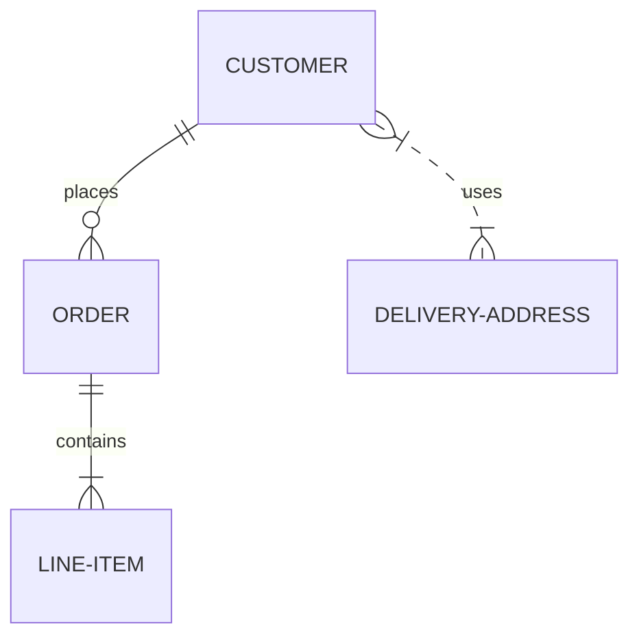
```mermaid
erDiagram
    CUSTOMER ||--o{ ORDER : places
    ORDER ||--|{ LINE-ITEM : contains
    CUSTOMER }|..|{ DELIVERY-ADDRESS : uses
```

### 用户旅程图

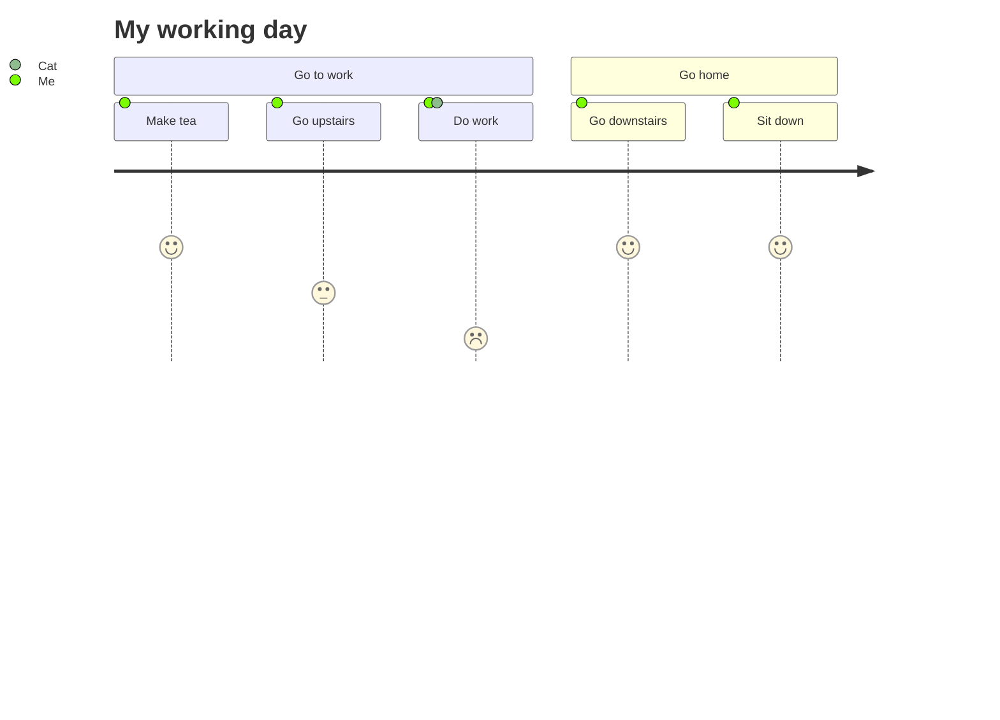
```mermaid
journey
    title My working day
    section Go to work
      Make tea: 5: Me
      Go upstairs: 3: Me
      Do work: 1: Me, Cat
    section Go home
      Go downstairs: 5: Me
      Sit down: 5: Me
```

### 甘特图

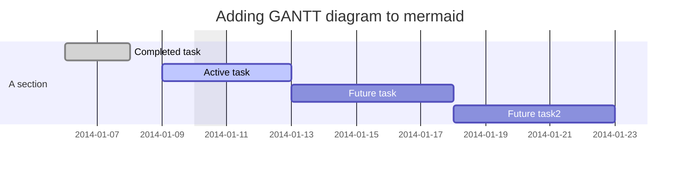
```mermaid
gantt
dateFormat  YYYY-MM-DD
title Adding GANTT diagram to mermaid
excludes weekdays 2014-01-10

section A section
Completed task            :done,    des1, 2014-01-06,2014-01-08
Active task               :active,  des2, 2014-01-09, 3d
Future task               :         des3, after des2, 5d
Future task2               :         des4, after des3, 5d
```

### 饼图

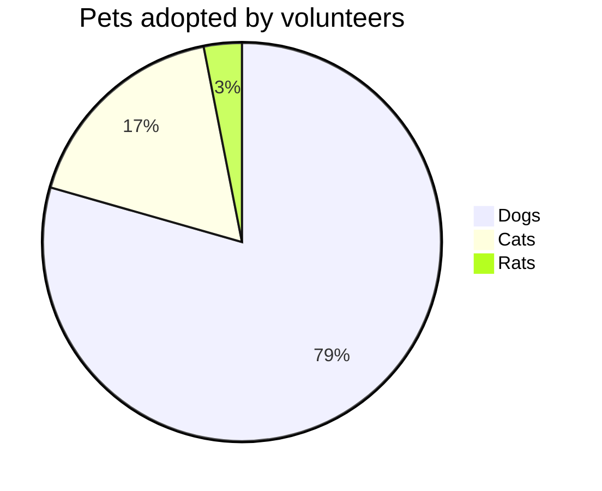
```mermaid
pie title Pets adopted by volunteers
    "Dogs" : 386
    "Cats" : 85
    "Rats" : 15
```

### 象限图

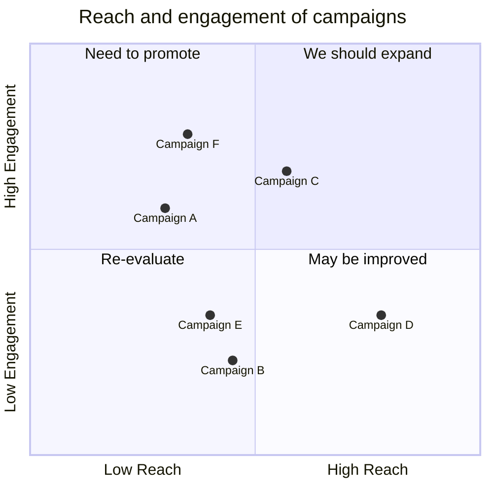
```mermaid
quadrantChart
    title Reach and engagement of campaigns
    x-axis Low Reach --> High Reach
    y-axis Low Engagement --> High Engagement
    quadrant-1 We should expand
    quadrant-2 Need to promote
    quadrant-3 Re-evaluate
    quadrant-4 May be improved
    Campaign A: [0.3, 0.6]
    Campaign B: [0.45, 0.23]
    Campaign C: [0.57, 0.69]
    Campaign D: [0.78, 0.34]
    Campaign E: [0.40, 0.34]
    Campaign F: [0.35, 0.78]
```

### 需求图

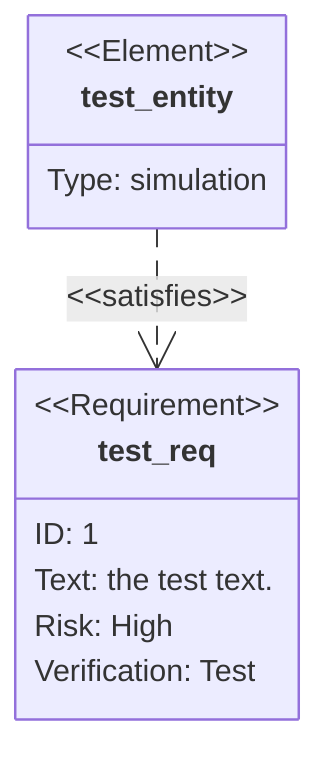
```mermaid
    requirementDiagram

    requirement test_req {
    id: 1
    text: the test text.
    risk: high
    verifymethod: test
    }

    element test_entity {
    type: simulation
    }

    test_entity - satisfies -> test_req
```

### Git 图

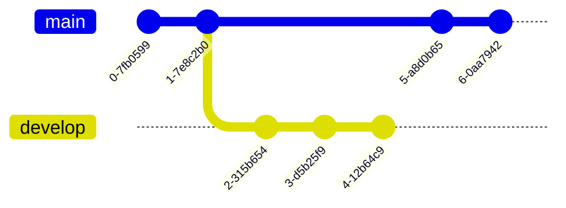
```mermaid
    gitGraph
       commit
       commit
       branch develop
       commit
       commit
       commit
       checkout main
       commit
       commit
```

### C4 图

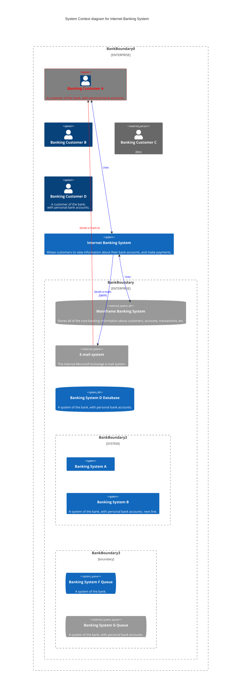
```mermaid
    C4Context
      title System Context diagram for Internet Banking System
      Enterprise_Boundary(b0, "BankBoundary0") {
        Person(customerA, "Banking Customer A", "A customer of the bank, with personal bank accounts.")
        Person(customerB, "Banking Customer B")
        Person_Ext(customerC, "Banking Customer C", "desc")

        Person(customerD, "Banking Customer D", "A customer of the bank, <br/> with personal bank accounts.")

        System(SystemAA, "Internet Banking System", "Allows customers to view information about their bank accounts, and make payments.")

        Enterprise_Boundary(b1, "BankBoundary") {

          SystemDb_Ext(SystemE, "Mainframe Banking System", "Stores all of the core banking information about customers, accounts, transactions, etc.")

          System_Boundary(b2, "BankBoundary2") {
            System(SystemA, "Banking System A")
            System(SystemB, "Banking System B", "A system of the bank, with personal bank accounts. next line.")
          }

          System_Ext(SystemC, "E-mail system", "The internal Microsoft Exchange e-mail system.")
          SystemDb(SystemD, "Banking System D Database", "A system of the bank, with personal bank accounts.")

          Boundary(b3, "BankBoundary3", "boundary") {
            SystemQueue(SystemF, "Banking System F Queue", "A system of the bank.")
            SystemQueue_Ext(SystemG, "Banking System G Queue", "A system of the bank, with personal bank accounts.")
          }
        }
      }

      BiRel(customerA, SystemAA, "Uses")
      BiRel(SystemAA, SystemE, "Uses")
      Rel(SystemAA, SystemC, "Sends e-mails", "SMTP")
      Rel(SystemC, customerA, "Sends e-mails to")

      UpdateElementStyle(customerA, $fontColor="red", $bgColor="grey", $borderColor="red")
      UpdateRelStyle(customerA, SystemAA, $textColor="blue", $lineColor="blue", $offsetX="5")
      UpdateRelStyle(SystemAA, SystemE, $textColor="blue", $lineColor="blue", $offsetY="-10")
      UpdateRelStyle(SystemAA, SystemC, $textColor="blue", $lineColor="blue", $offsetY="-40", $offsetX="-50")
      UpdateRelStyle(SystemC, customerA, $textColor="red", $lineColor="red", $offsetX="-50", $offsetY="20")

      UpdateLayoutConfig($c4ShapeInRow="3", $c4BoundaryInRow="1")
```


### 思维导图

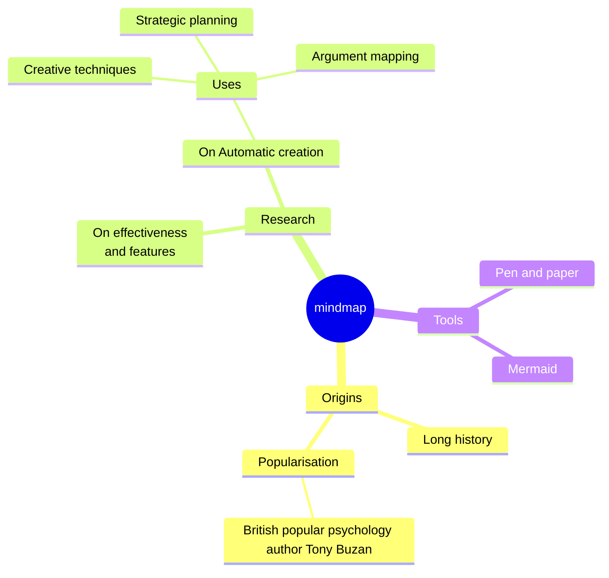
```mermaid
mindmap
  root((mindmap))
    Origins
      Long history
      ::icon(fa fa-book)
      Popularisation
        British popular psychology author Tony Buzan
    Research
      On effectiveness<br/>and features
      On Automatic creation
        Uses
            Creative techniques
            Strategic planning
            Argument mapping
    Tools
      Pen and paper
      Mermaid
```

### 时间线图

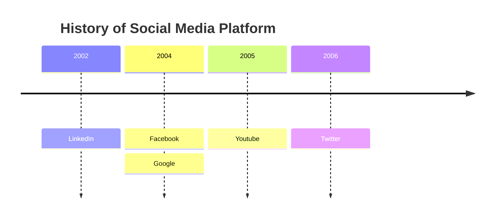
```mermaid
timeline
    title History of Social Media Platform
    2002 : LinkedIn
    2004 : Facebook
         : Google
    2005 : Youtube
    2006 : Twitter
```

### ZenUML

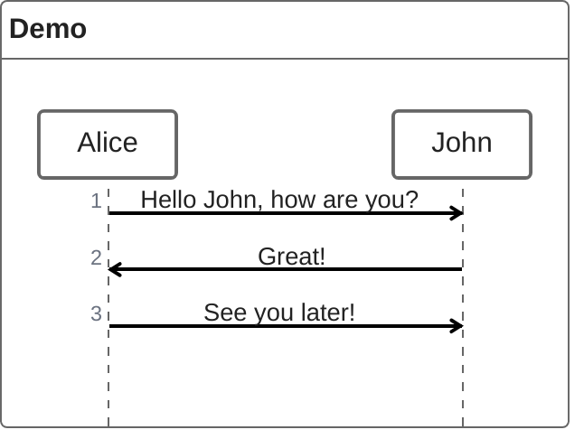
```mermaid
zenuml
    title Demo
    Alice->John: Hello John, how are you?
    John->Alice: Great!
    Alice->John: See you later!
```

### 桑基图

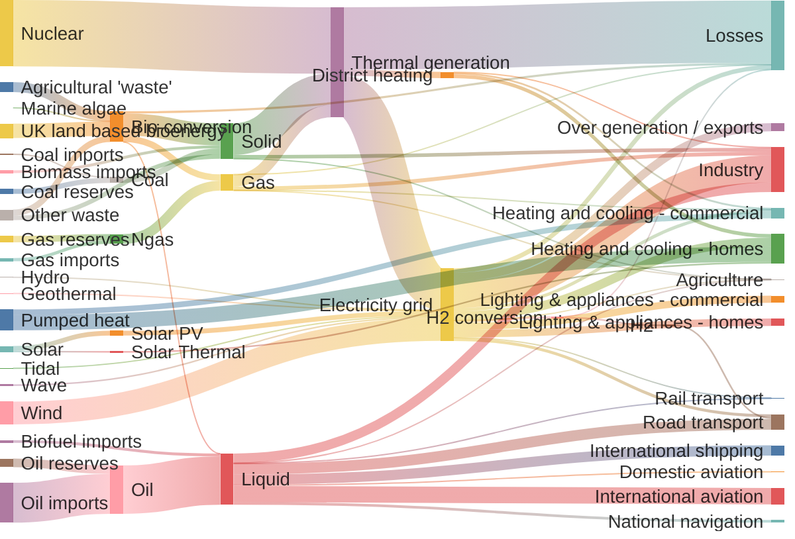
```mermaid
---
config:
  sankey:
    showValues: false
---
sankey-beta

Agricultural 'waste',Bio-conversion,124.729
Bio-conversion,Liquid,0.597
Bio-conversion,Losses,26.862
Bio-conversion,Solid,280.322
Bio-conversion,Gas,81.144
Biofuel imports,Liquid,35
Biomass imports,Solid,35
Coal imports,Coal,11.606
Coal reserves,Coal,63.965
Coal,Solid,75.571
District heating,Industry,10.639
District heating,Heating and cooling - commercial,22.505
District heating,Heating and cooling - homes,46.184
Electricity grid,Over generation / exports,104.453
Electricity grid,Heating and cooling - homes,113.726
Electricity grid,H2 conversion,27.14
Electricity grid,Industry,342.165
Electricity grid,Road transport,37.797
Electricity grid,Agriculture,4.412
Electricity grid,Heating and cooling - commercial,40.858
Electricity grid,Losses,56.691
Electricity grid,Rail transport,7.863
Electricity grid,Lighting & appliances - commercial,90.008
Electricity grid,Lighting & appliances - homes,93.494
Gas imports,Ngas,40.719
Gas reserves,Ngas,82.233
Gas,Heating and cooling - commercial,0.129
Gas,Losses,1.401
Gas,Thermal generation,151.891
Gas,Agriculture,2.096
Gas,Industry,48.58
Geothermal,Electricity grid,7.013
H2 conversion,H2,20.897
H2 conversion,Losses,6.242
H2,Road transport,20.897
Hydro,Electricity grid,6.995
Liquid,Industry,121.066
Liquid,International shipping,128.69
Liquid,Road transport,135.835
Liquid,Domestic aviation,14.458
Liquid,International aviation,206.267
Liquid,Agriculture,3.64
Liquid,National navigation,33.218
Liquid,Rail transport,4.413
Marine algae,Bio-conversion,4.375
Ngas,Gas,122.952
Nuclear,Thermal generation,839.978
Oil imports,Oil,504.287
Oil reserves,Oil,107.703
Oil,Liquid,611.99
Other waste,Solid,56.587
Other waste,Bio-conversion,77.81
Pumped heat,Heating and cooling - homes,193.026
Pumped heat,Heating and cooling - commercial,70.672
Solar PV,Electricity grid,59.901
Solar Thermal,Heating and cooling - homes,19.263
Solar,Solar Thermal,19.263
Solar,Solar PV,59.901
Solid,Agriculture,0.882
Solid,Thermal generation,400.12
Solid,Industry,46.477
Thermal generation,Electricity grid,525.531
Thermal generation,Losses,787.129
Thermal generation,District heating,79.329
Tidal,Electricity grid,9.452
UK land based bioenergy,Bio-conversion,182.01
Wave,Electricity grid,19.013
Wind,Electricity grid,289.366

```

### XY 图

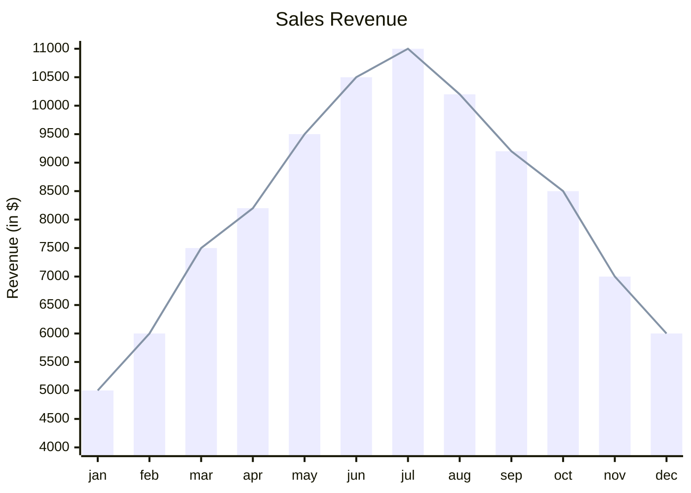
```mermaid
xychart-beta
    title "Sales Revenue"
    x-axis [jan, feb, mar, apr, may, jun, jul, aug, sep, oct, nov, dec]
    y-axis "Revenue (in $)" 4000 --> 11000
    bar [5000, 6000, 7500, 8200, 9500, 10500, 11000, 10200, 9200, 8500, 7000, 6000]
    line [5000, 6000, 7500, 8200, 9500, 10500, 11000, 10200, 9200, 8500, 7000, 6000]
```

### 框图

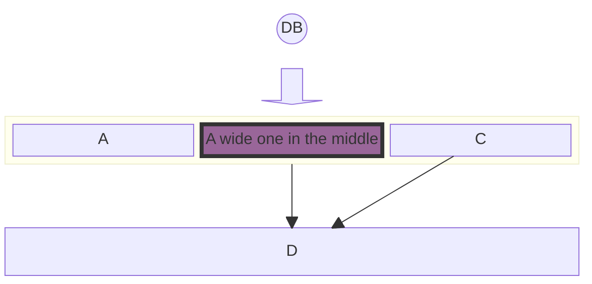
```mermaid
block-beta
columns 1
  db(("DB"))
  blockArrowId6<["&nbsp;&nbsp;&nbsp;"]>(down)
  block:ID
    A
    B["A wide one in the middle"]
    C
  end
  space
  D
  ID --> D
  C --> D
  style B fill:#969,stroke:#333,stroke-width:4px
```

### 数据包图

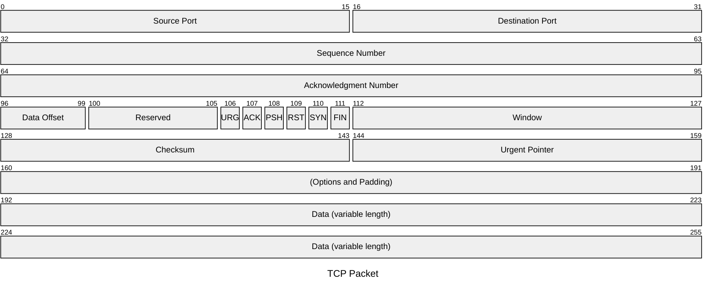
```mermaid
---
title: "TCP Packet"
---
packet-beta
0-15: "Source Port"
16-31: "Destination Port"
32-63: "Sequence Number"
64-95: "Acknowledgment Number"
96-99: "Data Offset"
100-105: "Reserved"
106: "URG"
107: "ACK"
108: "PSH"
109: "RST"
110: "SYN"
111: "FIN"
112-127: "Window"
128-143: "Checksum"
144-159: "Urgent Pointer"
160-191: "(Options and Padding)"
192-255: "Data (variable length)"
```

### 架构图

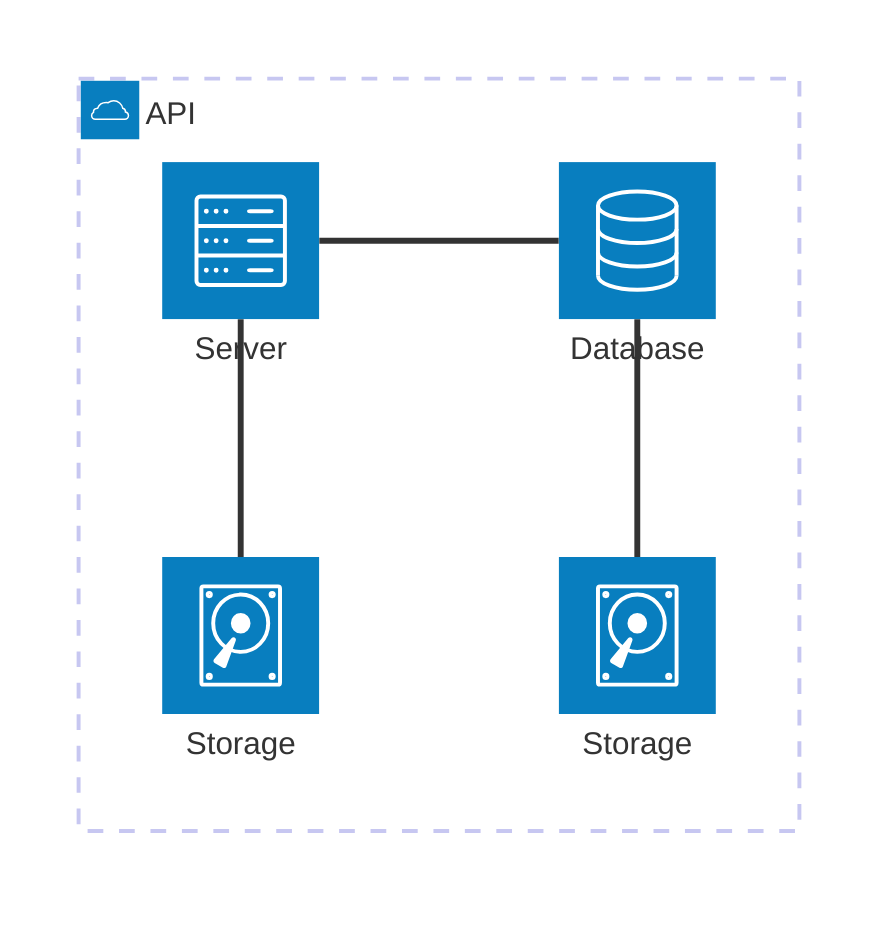
```mermaid
architecture-beta
    group api(cloud)[API]

    service db(database)[Database] in api
    service disk1(disk)[Storage] in api
    service disk2(disk)[Storage] in api
    service server(server)[Server] in api

    db:L -- R:server
    disk1:T -- B:server
    disk2:T -- B:db
```

### 架构图

```mermaid
architecture-beta
    group api(cloud)[API]

    service db(database)[Database] in api
    service disk1(disk)[Storage] in api
    service disk2(disk)[Storage] in api
    service server(server)[Server] in api

    db:L -- R:server
    disk1:T -- B:server
    disk2:T -- B:db
```
