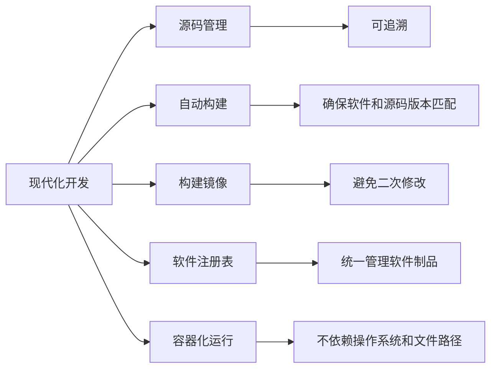
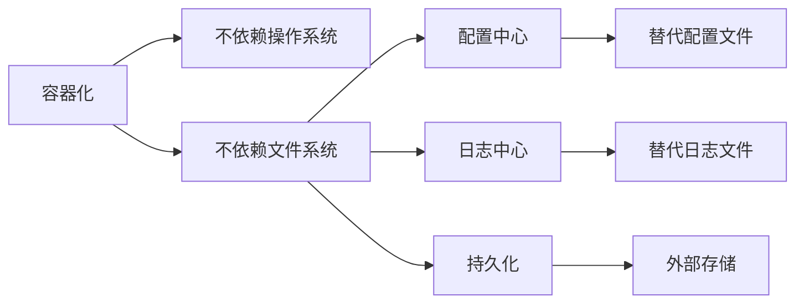
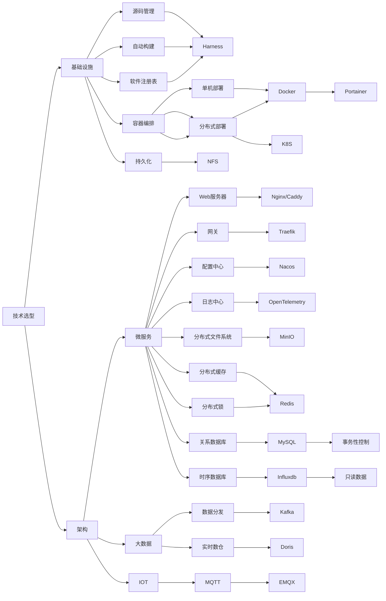

---
# https://vitepress.dev/reference/default-theme-home-page
layout: home
---

> 现代化开发

```mermaid
flowchart LR
  现代化开发 --> 源码管理 --> 可追溯
  现代化开发 --> 自动构建 --> 确保软件和源码版本匹配
  现代化开发 --> 构建镜像 --> 避免二次修改
  现代化开发 --> 软件注册表 --> 统一管理软件制品
  现代化开发 --> 容器化运行 --> 不依赖操作系统和文件路径
```

> 容器化

```mermaid
flowchart LR
  容器化 --> 不依赖操作系统
  容器化 --> 不依赖文件系统 --> 配置中心 --> 替代配置文件
  不依赖文件系统 --> 日志中心 --> 替代日志文件
  不依赖文件系统 --> 持久化 --> 外部存储
```

> 技术选型

```mermaid
flowchart LR
  技术选型 --> 基础设施
  基础设施 --> 源码管理 --> Harness
  基础设施 --> 自动构建 --> Harness
  基础设施 --> 软件注册表 --> Harness
  基础设施 --> 容器编排
  容器编排 --> 单机部署 --> Docker --> Portainer
  容器编排 --> 分布式部署 --> Docker
  容器编排 --> 分布式部署 --> K8S
  基础设施 --> 持久化 --> NFS
  技术选型 --> 架构 --> 微服务
  微服务 --> Web服务器 --> Nginx/Caddy
  微服务 --> 网关 --> Traefik
  微服务 --> 配置中心 --> Nacos
  微服务 --> 日志中心 --> OpenTelemetry
  微服务 --> 分布式文件系统 --> MinIO
  微服务 --> 分布式缓存 --> Redis
  微服务 --> 分布式锁 --> Redis
  微服务 --> 关系数据库 --> MySQL --> 事务性控制
  微服务 --> 时序数据库 --> Influxdb --> 只读数据
  架构 --> 大数据
  大数据 --> 数据分发 --> Kafka
  大数据 --> 实时数仓 --> Doris
  架构 --> IOT --> MQTT --> EMQX
```
